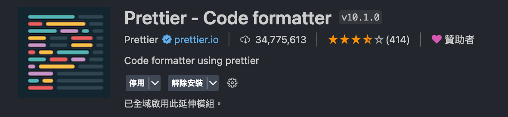

# 小組專題資料夾創建規範

- 統一使用『Prettier』外掛自動格式系統
  
- 所有 class 命名方式使用：小駝峰 (ex:menuList,pageItem,pageItemList)
- 使用 OOCSS、SMACSS、BEM 讓架構與樣式分離
- 如非共用名稱，可依 html 名稱當作統一前綴詞，避免與其他分頁名稱相同互相干擾。
- 使用 mixin 撰寫 RWD

---

# 網頁切版直播班-小組專題 Vite 設定

## 使用說明

- 下載後記得用 `npm install` -安裝套件
- 用 `npm run dev` - 執行開發模式後就可開始寫 code
- 所有新增頁面的 html 檔，請放置在 pages 內
- 所有新增頁面的 scss 檔，請放置在 assets/scss/pages 內，並記得在 assets/scss/all.scss 中 import
- 所有新增 layout 的 scss，請放置在 assets/scss/layout 內，並記得在 assets/scss/all.scss 中 import
- 已拆出 html 的 head 部分於 layout 中，若有需要增加 link，請直接加在 layout/htmlHead.ejs 中
- 新增頁面時，請記得 include 四個 layout 頁面。
- 需客製化 bootstrap 時，請從 node_modules/bootstrap/scss
  中複製出要客製化的檔案，放入 assets/scss/helpers 或 assets/scss/components 中，
  並記得在 assets/scss/all.scss 中 import

---

## Node.js 版本

- 專案的 Node.js 版本需為 v16 以上
- 查看自己版本指令：`node -v`

## 指令列表

- `npm install` - 初次下載該範例專案後，需要使用 npm install 來安裝套件
- `npm run dev` - 執行開發模式
  - 若沒有自動開啟瀏覽器，可嘗試手動在瀏覽器上輸入
    `http://localhost:5173/<專案名稱>/pages/index.html`
- `npm run build` - 執行編譯模式（不會開啟瀏覽器）
- `npm run deploy` - 自動化部署

## 資料夾結構

- assets # 靜態資源放置處

  - images # 圖片放置處
  - scss # SCSS 的樣式放置處

- layout # ejs 模板放置處
- pages # 頁面放置處

- JavaScript 程式碼可寫在 main.js 檔案

### 注意事項

- 已將 pages 資料夾內的 index.html 預設為首頁，建議不要任意修改 index.html 的檔案名稱
- .gitignore 檔案是用來忽略掉不該上傳到 GitHub 的檔案（例如 node_modules），請不要移除 .gitignore

## 開發模式的監聽

vite 專案執行開發模式 `npm run dev` 後即會自動監聽，不需要使用 `Live Sass Compiler` 的 `Watch SCSS` 功能
